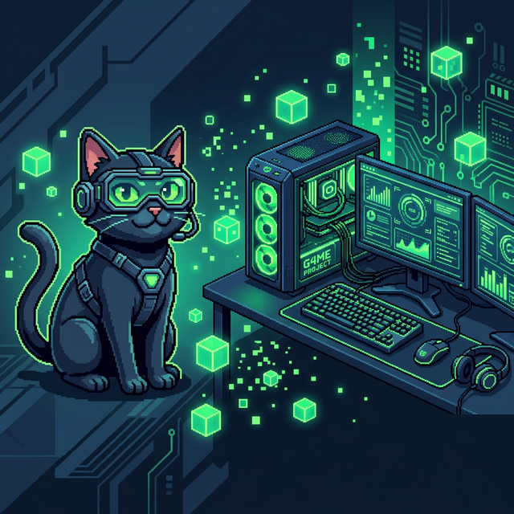
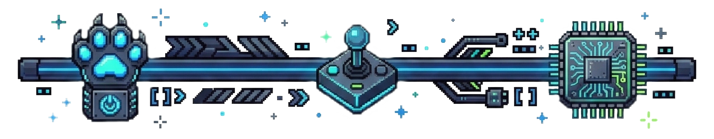

<p align="center">
  
</p>

# <p align="center">Professional Adventure Game</p>

<p align="center">
  <strong>Un proyecto narrativo interactivo para el foro de la UNIR</strong>
</p>

<p align="center">
  
  
  
</p>

<p align="center">
  
</p>

## 🌟 Sobre el Proyecto

¡Hola compañeros de la **UNIR**! 👋 Este juego no es solo un código, es una experiencia diseñada para demostrar cómo la narrativa y la programación se dan la mano. Creado con mucho cariño para compartirlo en el foro, este proyecto es **100% de uso libre**. 

¡Crea tu propia versión, rompe el código o úsalo para lo que quieras! 

---

## 🎮 ¿Qué hay dentro?

Sumérgete en un estudio de videojuegos real y elige tu camino:

| Rol | Compañero | ¿De qué va? |
| :--- | :--- | :--- |
| **💻 Dev Route** | Laura | Arquitectura, lógica y peleas con el código. |
| **📊 Data Analyst** | Lee | Patrones, Big Data y predicciones locas. |
| **🏆 Project Manager** | Jesica | Estrategia, mando y el arte de no quemar al equipo. |

<p align="center">
  
</p>

## 🛠️ Stack Tecnológico

He usado herramientas modernas para que el juego vuele:
*   **React 19** para la interfaz dinámica.
*   **Vite** para una velocidad de desarrollo brutal.
*   **Zustand** para gestionar el estado de la partida.
*   **Tailwind CSS** para que todo se vea de lujo.

---

## 🚀 Cómo ponerlo en marcha (Local)

Si quieres trastear con el código en tu PC:

1.  **Clona este repo** con el comando de git.
2.  **Instala las dependencias**:
    ```bash
    npm install
    ```
3.  **Dale caña**:
    ```bash
    npm run dev
    ```
4.  Entra en `localhost:5173` y ¡a jugar! 🎈

---

<p align="center">
  Hecho con ❤️ para la comunidad de la <b>UNIR</b>.<br>
</p>

<p align="center">
  
</p>
